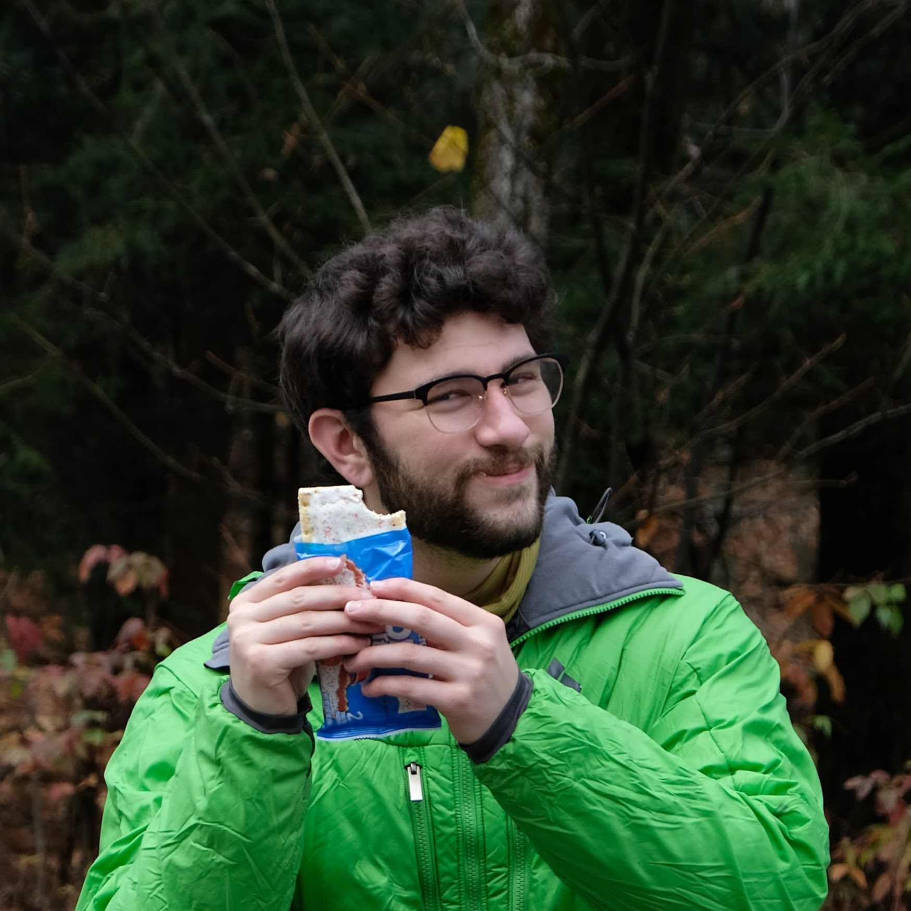
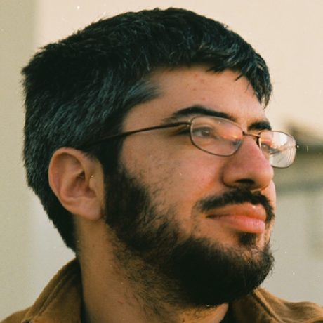

### Eric Roels (eroels@mines.edu)

Hey! My name is Eric, I'm a graduate student here at the Colorado School of Mines studying Computer Science.
My higher-education journey began at Colgate University where I received by Bachelor's in Astronomy-Physics in early 2021.
While studying physics, I also took several CS courses and quickly found that I enjoyed it much more, so I made the switch after graduating. 
I'm now working on my Master's Degree (est. graduation in Spring 2023) as a part of the CS@Mines [Bridge Program](https://cs.mines.edu/csbridge/) for non-majors.

### Professor Gabe Fierro

Gabe is an assistant professor here at the Colorado School of Mines, with a joint appointment at NREL (National Renewable Energy Laboratories).
He works at the intersection of databases, systems, information modeling, data science, the built environment and the Internet of Things, focusing his research
around designing, building and deploying systems that enable sustainable practices by making data easier to discover, manage and leverage.
He received his PhD in Computer Science from UC Berkeley in 2021, advised by Dr. David E. Culler. He was part of the Buildings, Energy and Transportation Systems project and the RISE lab. 
His dissertation is titled Self-Adapting Software for Cyberphysical Systems.

You can learn more about Gabe Fierro and his awesome work on his (much nicer looking) [personal website](https://home.gtf.fyi/)

[GitHub Repository](https://github.com/ERoels23/ERoels23.github.io/)
